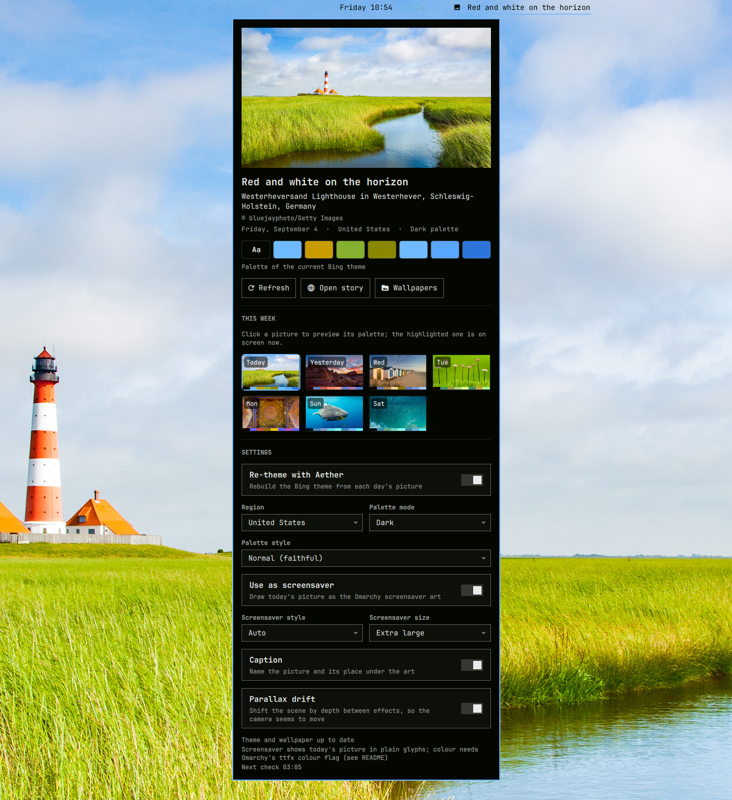
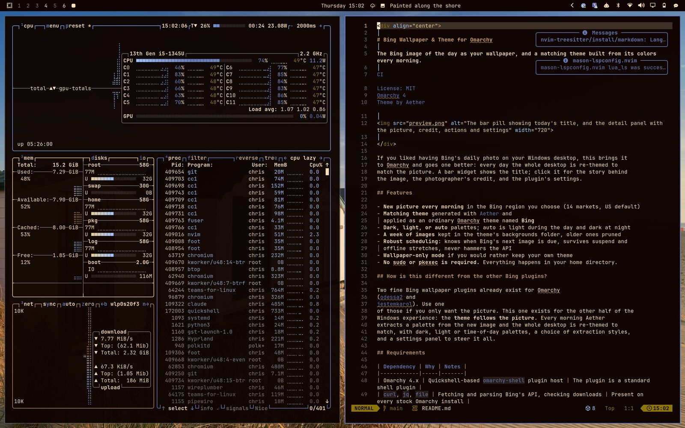
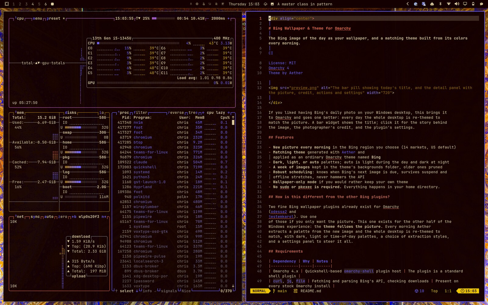
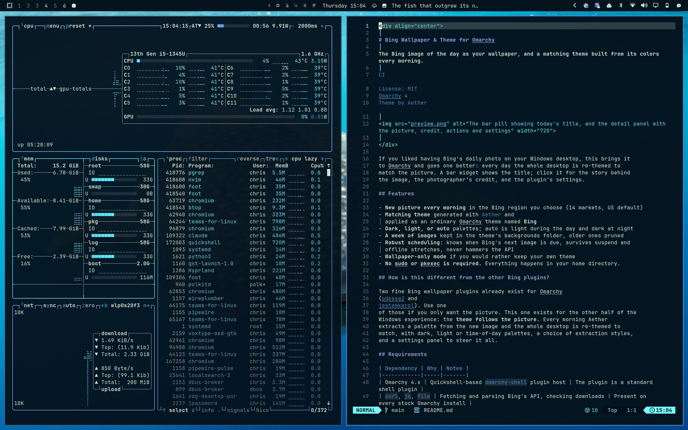
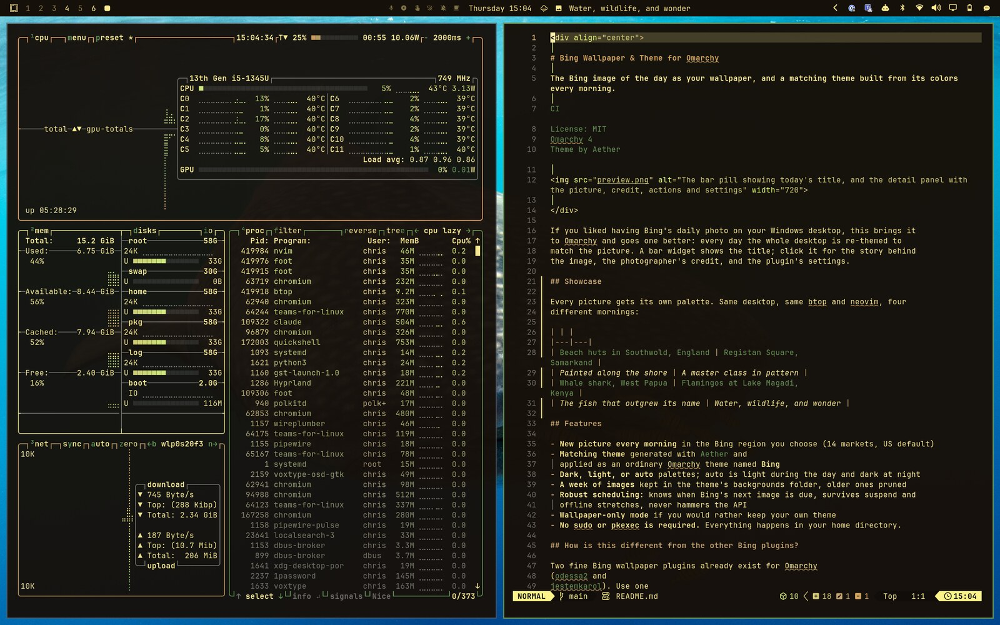
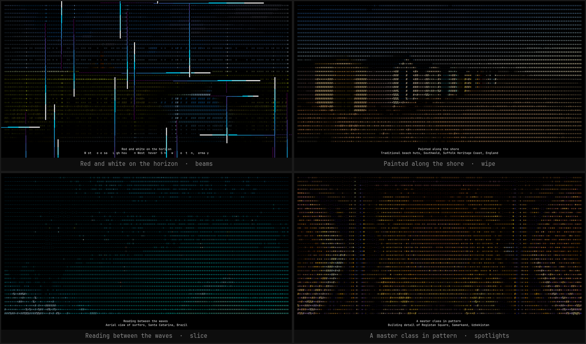

<div align="center">

# Bing Wallpaper & Theme for Omarchy

**The Bing image of the day as your wallpaper, and a matching theme built from its colors every morning.**

[](https://github.com/chrisandtre/omarchy-bing-wallpaper/actions/workflows/ci.yml)
[](LICENSE)
[](https://omarchy.org)
[](https://github.com/omacom/aether)



</div>

If you liked having Bing's daily photo on your Windows desktop, this brings it
to Omarchy and goes one better: every day the whole desktop is re-themed to
match the picture. A bar widget shows the title; click it for the story behind
the image, the photographer's credit, and the plugin's settings.

## Showcase

Every picture gets its own palette. Same desktop, same btop and neovim, four
different mornings:

| | |
|---|---|
|  |  |
| *Painted along the shore* | *A master class in pattern* |
|  |  |
| *The fish that outgrew its name* | *Water, wildlife, and wonder* |

## Features

- **New picture every morning** in the Bing region you choose (14 markets, US default)
- **Matching theme** generated with [Aether](https://github.com/omacom/aether) and
  applied as an ordinary Omarchy theme named **Bing**
- **Dark, light, or auto** palettes; auto is light during the day and dark at night
- **A week of pictures from day one.** The first fetch brings down the last
  seven days, not just today's, so the archive is full before you have finished
  reading this. One new picture a day after that, the oldest pruned
- **Preview before you switch.** The panel shows the week as a grid; click any
  picture to see the palette Aether would build from it, then apply it with one
  more click. The theme follows the picture, exactly as it does each morning
- **Robust scheduling**: knows when Bing's next image is due, survives suspend and
  offline stretches, never hammers the API
- **Wallpaper-only mode** if you would rather keep your own theme
- **Matching screensaver**: today's picture drawn as ASCII art in place of the
  Omarchy logo, dissolved by the same `ttfx` effects, in the photograph's own
  colours, with a sense of depth, a slow parallax drift between effects and a
  caption naming the place. On by default; one toggle puts your old art back
- **No sudo or pkexec is required** for anything the plugin does on its own.
  Everything happens in your home directory. (The one exception is installing
  ImageMagick for the screensaver, which is an ordinary package install you
  run yourself.)

## How is this different from the other Bing plugins?

Two fine Bing wallpaper plugins already exist for Omarchy
([odessa2](https://github.com/odessa2/bing-wallpaper-for-omarchy) and
[jestemkarol](https://github.com/jestemkarol/bing-wallpaper-omarchy)). Use one
of those if you only want the picture. This one exists for the other half of the
Windows experience: the **theme follows the picture**. Every morning Aether
extracts a palette from the new image and the whole desktop is re-themed to
match, with dark, light or time-of-day palettes, a choice of extraction styles,
and a settings panel to steer it all.

## Requirements

| Dependency | Why | Notes |
|------------|-----|-------|
| Omarchy 4.x | Quickshell-based `omarchy-shell` plugin host | The plugin is a standard shell plugin |
| `curl`, `jq`, `file` | Fetching and parsing Bing's API, checking downloads | Present on every stock Omarchy install |
| [Aether](https://github.com/omacom/aether) | Extracting a palette from each picture | Optional. Without it the plugin sets the wallpaper only and says so in the panel. `omarchy pkg aur add aether` |
| `magick` (ImageMagick) | Rendering the screensaver art | Optional, and only when the screensaver setting is on. `bing-wallpaper install-deps` installs it |
| `socat` | Waking the parallax loop when the screensaver opens | Present on stock Omarchy; without it the loop polls instead |

## Install

```bash
omarchy plugin add https://github.com/chrisandtre/omarchy-bing-wallpaper.git --enable
```

You will be asked which bar section to place the widget in (center by default).
Enabling the widget also starts the background service. About eight seconds
later the first picture is fetched, the **Bing** theme is created under
`~/.config/omarchy/themes/bing`, and your desktop switches to it.

Move the widget later with `omarchy bar move io.github.chrisandtre.bing-wallpaper --section right`, and
disable or remove it from `Omarchy Menu > Setup > Plugins`.

## Using it

| Action | How |
|--------|-----|
| Show the picture, credit and settings | Left-click the bar pill |
| Refresh now | Middle-click the pill, or **Refresh** in the panel |
| Read today's story on Bing | Right-click the pill, or **Open story** |
| See what another day's picture would do to the theme | Click it under **This week** in the panel; the palette chips update |
| Switch to that picture and theme | **Use this picture** (or press Return); Escape goes back to the current one |
| Open this week's images | **Wallpapers** in the panel |
| Cycle through the week's images | `omarchy theme bg next` |
| Switch pictures from the terminal | `bing-wallpaper apply 2026-09-01`, `apply 2` (days ago), or `fetch --day 2` |
| From a script or keybinding | `omarchy-shell io.github.chrisandtre.bing-wallpaper refresh`, or `... apply 2026-09-01` |

A picture you pick by hand stays until Bing's next image lands, then the daily
rhythm resumes.

## Settings

The panel has the settings most people touch: region, palette mode, palette
style, and the re-theme switch. They are stored inline on the widget's entry in
`~/.config/omarchy/shell.json`, the same way every Omarchy bar widget stores its
options, so nothing else on your system is modified.

| Setting | Default | Meaning |
|---------|---------|---------|
| `market` | `en-US` | Bing region: `en-GB`, `en-CA`, `fr-CA`, `en-AU`, `en-NZ`, `en-IN`, `de-DE`, `fr-FR`, `es-ES`, `it-IT`, `pt-BR`, `ja-JP`, `zh-CN` |
| `mode` | `dark` | `dark`, `light`, or `auto` (light between `lightStart` and `lightEnd`) |
| `lightStart` | `7` | Hour (0-23) when `auto` switches to the light palette |
| `lightEnd` | `19` | Hour (0-24) when `auto` switches back to dark |
| `extractMode` | `normal` | Aether extraction mode: `normal`, `colorful`, `muted`, `pastel`, `bright`, `material`, `analogous`, `monochromatic`, `high-contrast` |
| `applyTheme` | `true` | `false` keeps your current theme and only sets the wallpaper |
| `retentionDays` | `7` | How many days of pictures to keep and show in the panel (Bing serves at most 8) |
| `notify` | `true` | Desktop notification when a new picture lands |
| `resolution` | `UHD` | Preferred download size; falls back to `1920x1200`, then `1920x1080` |
| `screensaver` | `true` | Draw today's picture as the Omarchy screensaver art |
| `screensaverSize` | `120x29` | Art size in terminal cells: `80x20`, `120x29`, `160x39`, `200x48` (the caption comes out of this budget) |
| `screensaverStyle` | `auto` | `depth` (colour with depth and parallax), `color`, `mono` (plain glyphs), or `auto`: `depth` where Omarchy keeps colour, `mono` where it does not |
| `screensaverCaption` | `true` | Write the picture's title and place under the art |
| `screensaverParallax` | `true` | Drift the scene by depth between effects (`depth` style only) |
| `showTitle` | `true` | Show the title next to the icon in the bar |
| `maxTitleChars` | `28` | Truncate long titles in the bar |

Example entry in `shell.json`:

```json
{ "id": "io.github.chrisandtre.bing-wallpaper", "market": "en-GB", "mode": "auto", "extractMode": "muted" }
```

## Screensaver

Today's picture is drawn as ASCII art in place of the Omarchy logo, dissolved by
the same random `ttfx` effects as always — the vibe is unchanged, the picture is
not. This is **on by default**; **Use as screensaver** in the panel turns it off
and puts your old art back.



<sub>Four mornings, four pictures, four of the random effects `ttfx` picks from.
These are real screenshots of the running screensaver, not mockups.</sub>

Omarchy's screensaver is a single plain-text file. `omarchy-screensaver` loops

```sh
ttfx -i ~/.config/omarchy/branding/screensaver.txt --random-effect ...
```

re-reading it every cycle, so writing that file is the whole integration. There
is nothing to restart, and a screensaver that is already running picks up the
new picture on its next effect.

**Styles.** `screensaverStyle` picks how the picture is drawn:

- `mono` — a plain luminance ramp, the way it worked before 0.5.
- `color` — every cell carries the photograph's own colour as a truecolor
  escape. Sky is blue, grass is green, a lighthouse is red and white; and since
  the theme is extracted from the same pixels, the art matches the theme by
  construction.
- `depth` — colour plus a cheap sense of space. The horizon is found, distant
  ground fades toward the sky's haze, near cells get heavier glyphs, and five
  frames shifted by distance are rendered so the parallax loop can drift the
  camera between effects (below). Close-ups with no plausible horizon come out
  flat, which is the right answer for them.
- `auto` (default) — `depth` where colour works, `mono` where it does not.

**Colour needs one line from Omarchy.** `ttfx` honours the colours in its input
only when told to, and stock Omarchy 4.0's `omarchy-screensaver` does not tell
it. Until it does, the escapes are stripped and coloured art degrades to plain
glyphs — which is why `auto` picks `mono` on a stock system, and the panel's
status line says so. The change is one flag on the `ttfx` line in
`/usr/bin/omarchy-screensaver`:

```sh
ttfx -i ~/.config/omarchy/branding/screensaver.txt \
    --existing-color-handling dynamic \
    --frame-rate 120 ...
```

`dynamic` lets every effect play in its own colours and settle into the
picture's; `always` keeps the picture's colours throughout. The plugin detects
the flag and switches `auto` to `depth` on the next fetch. The file is owned by
the `omarchy` package, so a hand edit lasts until the next update; a pull
request adding the flag upstream is the proper fix.

**Parallax.** With `depth`, the service keeps `bing-wallpaper parallax` running.
It sleeps on Hyprland's event socket until a screensaver window opens, then
each time `omarchy-screensaver` starts a new effect it swaps the next frame into
`screensaver.txt` — the effect that just began has already read the file, so it
is the *following* dissolve that shows the shifted picture. Near ground moves
up to three cells, the horizon barely moves, and the order is out to one side,
back through the middle and out to the other, so the camera seems to wander
slowly through the scene. `screensaverParallax` turns it off.

**Caption.** The title and place Bing gives the picture are centred under the
art, so a lighthouse four cells wide still gets named. `screensaverCaption`
turns it off. The caption comes out of the `screensaverSize` budget, so the
whole thing still fits the screen it was sized for.

**On sizing.** `ttfx` centres the art without scaling it, and Omarchy's own logo
is a fixed 79x28 on every display regardless of monitor, so this plugin uses a
fixed size too rather than trying to adapt per screen. Terminal cells are about
2.3x taller than they are wide, so the presets keep a 16:9 picture looking
square. The `120x29` default still fits the smallest canvas worth planning for
(a 1080p display at the screensaver's font size is roughly 133x32 cells); the
larger presets need a bigger screen and will be clipped on a small one.

**On your own art.** `branding/screensaver.txt` belongs to you — `omarchy
branding screensaver` writes it too. The first time the plugin touches it, your
existing art is copied to `~/.local/state/bing-wallpaper/screensaver.txt.orig`,
and turning the setting back off restores it exactly. If you have edited the
file yourself since, the plugin leaves it alone rather than overwriting your
work, and the parallax loop stops rotating it.

**Why not `omarchy transcode ascii`?** Omarchy ships an image-to-ASCII
transcoder, but it is a 1-bit hard threshold built for logos: a photograph
through it comes out a near-solid block. This plugin does its own luminance-ramp
pass instead, which keeps the tonal range a picture needs.

The bundled CLI edits the same entry:

```bash
~/.config/omarchy/plugins/io.github.chrisandtre.bing-wallpaper/bin/bing-wallpaper set market en-GB
~/.config/omarchy/plugins/io.github.chrisandtre.bing-wallpaper/bin/bing-wallpaper set mode auto
```

## How it works

```
Service.qml ── every 15 min ──▶ bin/bing-wallpaper fetch
                                      │
                                      ├─ Bing HPImageArchive API: the last 8 days (title, credit, story link)
                                      ├─ download today's JPEG ─▶ ~/.config/omarchy/themes/bing/backgrounds/
                                      ├─ aether --generate --no-apply ─▶ colors.toml (normalized for Omarchy)
                                      ├─ omarchy theme set bing ; omarchy theme bg set <today>
                                      ├─ ~/.local/state/bing-wallpaper/state.json
                                      │
                                      └─ then, for the week behind it:
                                         ├─ download anything missing
                                         ├─ aether --generate --no-apply per picture ─▶ its palette
                                         └─ ~/.local/state/bing-wallpaper/archive.json
                                                      ▲
BarWidget.qml + Panel.qml ── watch both ─────────────┘
```

The fetch is idempotent. It records when Bing's next picture is due and does
nothing until then, unless a setting changed or you asked for a refresh. Theme
application, which restarts terminals and re-tints apps exactly like
`omarchy theme set`, only happens when the picture or palette actually changed.

The archive is filled in after today's picture is on screen, so a first run
themes the desktop within a couple of seconds and the rest of the week arrives
behind it. Each archived picture's palette is extracted once per palette mode
and style (about 50 ms each) and cached in `archive.json`; changing **Palette
mode** or **Palette style** recomputes all of them so the previews always show
what you would actually get.

## What it touches

For people who like to know before they install:

- **Network:** `www.bing.com` only, for the daily metadata and the image.
- **Writes:** `~/.config/omarchy/themes/bing/` (the generated theme and images),
  `~/.local/state/bing-wallpaper/` (`state.json`, `archive.json`), and its own entry in
  `~/.config/omarchy/shell.json`. Omarchy's own theme machinery then updates the
  usual per-app theme files, as it does for any theme switch.
- **Runs:** `curl`, `jq`, `file`, `aether`, and Omarchy's `omarchy-theme-set`,
  `omarchy-theme-bg-set`, `omarchy-notification-send`, `omarchy-launch-browser`.
- **Privileges:** none. No sudo or pkexec is required.

## CLI

```
bing-wallpaper fetch [--force] [--day N] [--date YYYY-MM-DD] [--market MKT] [--mode dark|light|auto]
                             # --day N applies the picture from N days ago (0-7);
                             # it holds until tomorrow's image arrives
bing-wallpaper apply WHEN    # switch to an archived picture: a date, an id
                             # from `archive`, or N days ago
bing-wallpaper archive       # this week's pictures and their palettes (archive.json)
bing-wallpaper status        # contents of state.json
bing-wallpaper settings      # effective settings
bing-wallpaper set KEY VALUE # update a setting in shell.json
bing-wallpaper open [WHEN]   # open the story behind today's (or an archived) picture
bing-wallpaper next          # when the next check is due
bing-wallpaper install-deps  # install ImageMagick for the screensaver
bing-wallpaper parallax      # drift the screensaver between effects (the service runs this)
```

Every setting can be overridden per invocation with `BING_WALLPAPER_<KEY>`,
for example `BING_WALLPAPER_MARKET=ja-JP bing-wallpaper fetch --force`.

## Uninstall

```bash
omarchy plugin remove io.github.chrisandtre.bing-wallpaper       # removes the widget and stops the service
omarchy theme set tokyo-night           # or any theme you like
rm -rf ~/.config/omarchy/themes/bing ~/.local/state/bing-wallpaper
```

## Development

Clone this repository somewhere you like to work, then link it into the plugin
directory instead of installing a copy:

```bash
ln -s ~/Work/omarchy-bing-wallpaper ~/.config/omarchy/plugins/io.github.chrisandtre.bing-wallpaper
omarchy-shell shell rescanPlugins
omarchy plugin enable io.github.chrisandtre.bing-wallpaper
```

Edits made through the symlink do not hot-reload; run
`omarchy-shell shell rescanPlugins` after changing QML, and
`omarchy restart shell` after changing `Model.js` (the QML engine caches
JavaScript libraries). Validate before pushing with
`omarchy plugin validate ~/Work/omarchy-bing-wallpaper`; CI runs the same
manifest checks plus ShellCheck.

## Contributing

Issues and pull requests are welcome. Please keep the three places that define
settings in sync: `bin/bing-wallpaper` (defaults and validation), `Model.js`
(labels shown in the panel), and this README.

## License

[MIT](LICENSE). Bing images remain the property of their respective
photographers and agencies; the credit shown in the panel comes straight from
Bing, and this project is not affiliated with Microsoft or Bing.
